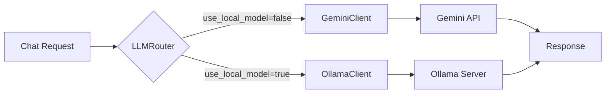
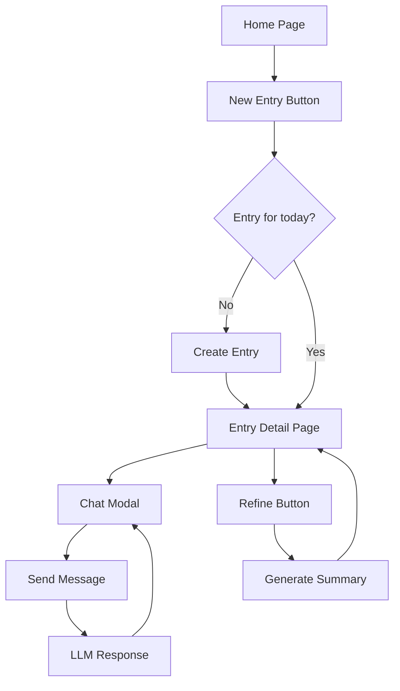

# Chat Interface, Gemini Integration & Goals UI

This document summarizes the implementation of conversational journaling for the Cognito PWA.

## Summary

Implemented a complete chat interface for conversational journaling with LLM integration (Gemini API + Ollama fallback) and a Goals management UI.

---

## Backend Changes

### New Files

| File | Description |
|------|-------------|
| `app/services/llm.py` | LLM service with `GeminiClient`, `OllamaClient`, and `LLMRouter` |
| `app/models/chat.py` | Pydantic models for chat requests/responses |
| `app/routers/chat.py` | Chat endpoints: `/api/chat` and `/api/chat/refine` |
| `tests/test_llm.py` | Unit tests for LLM clients |
| `tests/test_chat.py` | Integration tests for chat endpoints |

### Modified Files

| File | Change |
|------|--------|
| `app/main.py` | Registered chat router |
| `README.md` | Added Chat API documentation |

### LLM Service Architecture



### API Endpoints

#### POST /api/chat
- Sends a message and gets an LLM response
- Creates new conversation if `conversation_id` not provided
- Stores user message and assistant response in the entry

#### POST /api/chat/refine
- Generates a refined journal summary from all conversations
- Updates the entry's `refined_output` field

---

## Frontend Changes

### New Files

| File | Description |
|------|-------------|
| `src/lib/api/chat.ts` | Chat API client |
| `src/lib/api/goals.ts` | Goals API client |
| `src/lib/stores/chat.ts` | Chat state management with offline queue |
| `src/lib/stores/goals.ts` | Goals state management |
| `src/lib/components/Chat.svelte` | Chat UI component |
| `src/lib/components/GoalCard.svelte` | Goal display component |
| `src/lib/components/GoalFormModal.svelte` | Goal create/edit modal |
| `src/routes/entry/[id]/+page.svelte` | Entry detail page |
| `src/routes/entry/new/+page.svelte` | New entry page |
| `src/routes/goals/+page.svelte` | Goals management page |

### Modified Files

| File | Change |
|------|--------|
| `src/routes/+page.svelte` | Updated navigation to entry pages |

### User Flow



---

## Verification Results

### Backend Tests

All 30 tests passing:

```
tests/test_llm.py - 17 tests PASSED
tests/test_chat.py - 13 tests PASSED
============================== 30 passed ==============================
```

### Frontend

- Type checking: 0 errors, 0 warnings
- Unit tests: 44 tests passing

---

## Configuration

### Environment Variables

Add to your `.env` file:

```bash
# Gemini API (primary LLM)
GEMINI_API_KEY=your-gemini-api-key

# Ollama (local fallback)
OLLAMA_URL=http://localhost:11434
```

### Running with Ollama

To use local models instead of Gemini:

1. Install Ollama: https://ollama.ai
2. Pull a model: `ollama pull llama3.2`
3. Start Ollama: `ollama serve`
4. Set `use_local_model: true` in chat requests

---

## Next Steps

1. Add frontend tests for Chat and Goals components
2. Consider streaming via Server-Sent Events for real-time LLM responses
3. Add goal-aware prompts that incorporate user goals into chat conversations
